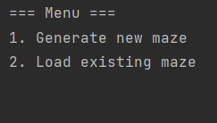
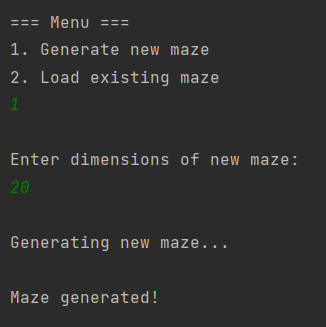
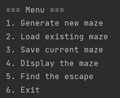
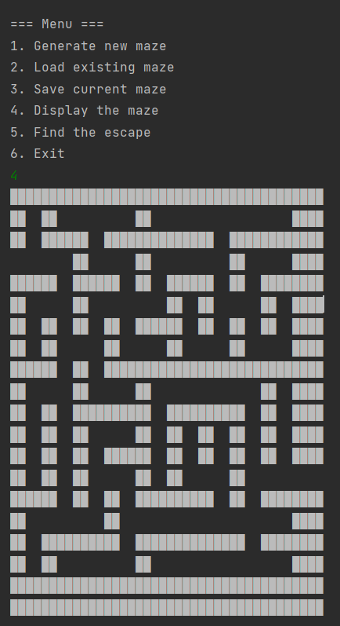
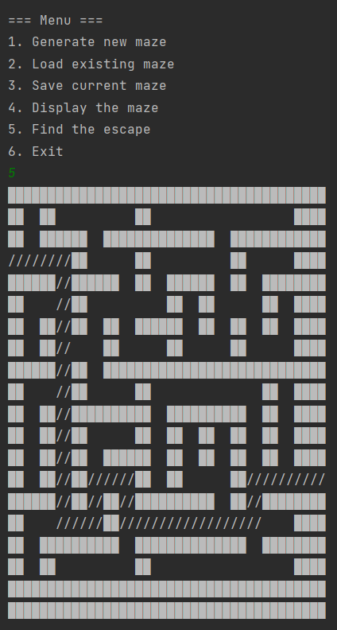
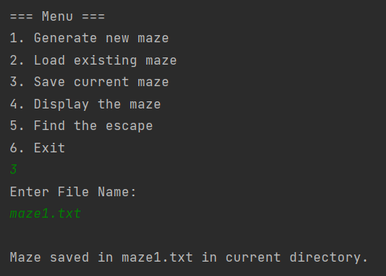
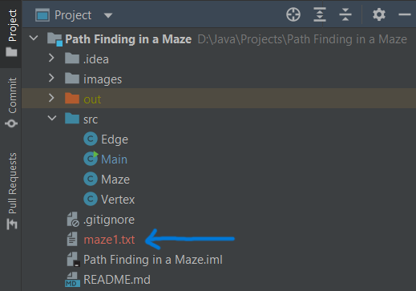
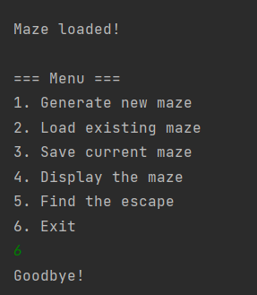

# Path Finding using a Maze
A program that implements basic path finding and other operations on a randomly generated maze.

## Operations:
- Generate a New Maze
- Load Maze from existing file
- Save Maze to file
- Display Loaded Maze
- Find Escape

## Working:
- Once Main.java is run, the user is prompted with 2 options,
	- Load maze from existing file
	- Generate new Maze
 
 

  

	
- If new maze is to be generated, the user in asked to input an integer as input for the dimensions of the maze.
 

  

- Once the maze has been loaded into the program from either of the mentioned options, the maze object in Main.java is updated and other operations are made available for use.
 

  

- The user is now prompted to perform any of the operations that were mentioned earlier. All the operations are coded in the 'Maze.java' file in the 'src' directory.
 

   

- User can save the maze to a file before terminating the program.
 

   

- When done, the program can be terminated by using the Exit option from the Menu.
 

  

